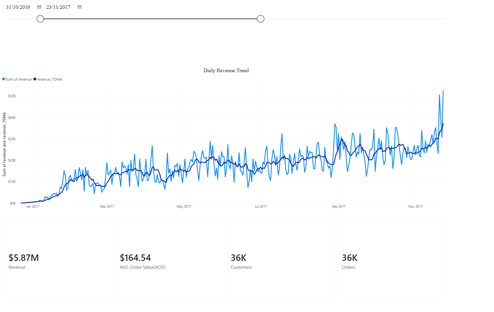
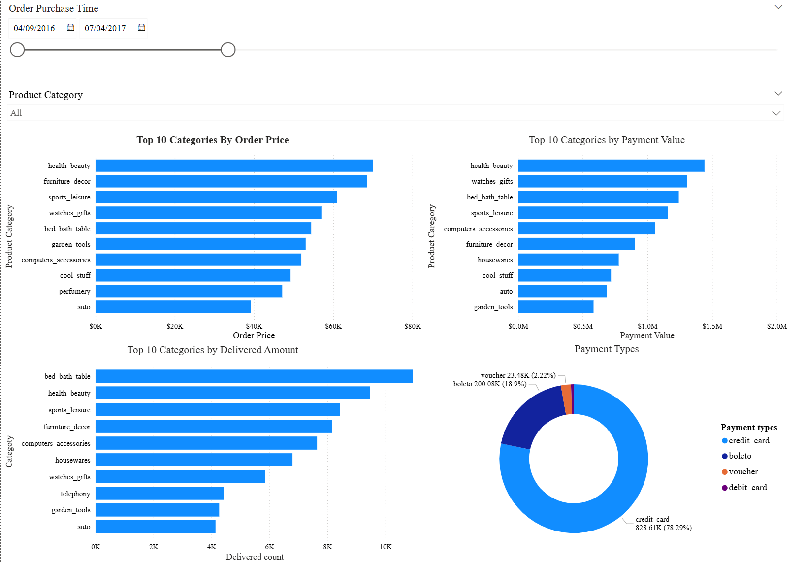

# 📊 Olist E-Commerce Analytics Engineering & Power BI Dashboard


## 📌 Executive Summary & Business Value
This project demonstrates an end-to-end Analytics Engineering workflow using the Olist Brazilian e-commerce dataset. Moving beyond simple visualization, I engineered a robust data pipeline that prioritizes data reliability and dimensional modeling. By implementing automated Data Quality (DQ) profiling and translating raw transactional schemas into lightweight, BI-ready data marts, this solution enables stakeholders to track revenue health and optimize category strategies without querying bottlenecked raw tables.

---

## 🎯 Business Objectives

* **Revenue Health Monitoring:** Track daily revenue trends, 7-day moving averages, and Average Order Value (AOV).
* **Category Strategy Optimization:** Compare “profit-driving” categories (high revenue) vs. “traffic-driving” categories (high delivered volume).
* **Payment Localization:** Analyze payment method preference patterns in the Brazilian market (e.g., credit card vs boleto).

---

## 🛠️ Data Architecture & Pipeline

To improve dashboard performance and ensure data reliability, raw tables were transformed into lightweight **data marts** using modular SQL scripts:

1. **`01_data_quality_checks.sql` (Data Profiling & QA)**

   * Validates row counts across core tables
   * Checks missingness in key fields (PK/FK, timestamps)
   * Detects duplicates
   * Validates join integrity (e.g., orphan payments/items)
     **Output:** `dq_summary`

2. **`02_kpi_daily_mart.sql` (Time-Series KPI Mart)**

   * Aggregates daily metrics using CTEs
   * Produces daily Orders, Customers, Revenue, and AOV
   * Handles null values and zero-division cases
     **Output:** `kpi_daily`

3. **`03_category_marts.sql` (Category-Level Marts)**

   * Builds category-level rollups for **payment value** and **delivered volume**
   * **Payment allocation logic:** since payments are recorded at the **order level** while categories are at the **item level**, order payments are allocated to items proportionally by item price within each order, then aggregated to category
     **Outputs:** `category_payment`, `category_delivered`

---

## 💡 Key Business Insights

### 1) Daily Trend



* **Upward Momentum:** The 7-day moving average (7DMA) shows steady growth across the analyzed period, smoothing out strong day-to-day volatility.
* **Core Metrics:** The dashboard tracks total revenue, total orders, total customers, and AOV across the selected date range.

> Note: Currency and units follow the dataset’s original context. If needed, metrics can be labeled explicitly (e.g., BRL) for clarity.

### 2) Category Performance & Payments




Revenue & Traffic Decoupling: The dimensional modeling revealed a critical business dynamic: "Traffic-driving" categories (highest delivered volume, e.g., Bed/Bath) differ significantly from "Profit-driving" categories (highest allocated payment value, e.g., Health/Beauty). This insight directly informs marketing spend and inventory allocation strategies.

Robust Payment Allocation Model: Designed a granular allocation algorithm in SQL to accurately distribute order-level payments (including freight and vouchers) down to the item-category level using weighted price ratios, solving a complex many-to-many granular reconciliation issue.

Data Integrity First: Built a dq_summary validation layer prior to BI ingestion to proactively trap orphan records, missing PK/FKs, and duplicate transactions, ensuring 100% financial reporting accuracy.
---

## 📁 Repository Structure

```text
├── Olist_data/
│   ├── 01_data_quality_checks.sql
│   ├── 02_kpi_daily_mart.sql
│   └── 03_category_marts.sql
│
├── scripts/
│   ├── dq_summary.csv
│   ├── kpi_daily.csv
│   ├── category_delivered.csv
│   └── category_payment.csv
│
├── images/
│   ├── Daily_Trend.png
│   └── Category_Performance_Payments.png
│
└── README.md
```

---

## ▶️ How to Run (Reproducibility)

### Option A — Run SQL to build marts (recommended)

1. Open your SQLite database containing the raw Olist tables.
2. Run scripts in order:

   * `sql/01_data_quality_checks.sql`
   * `sql/02_kpi_daily_mart.sql`
   * `sql/03_category_marts.sql`
3. Export mart tables to CSV if desired:

   * `dq_summary`, `kpi_daily`, `category_payment`, `category_delivered`

### Option B — Use exported marts directly

If you only want to review results quickly, use the CSVs in `data_marts/` and connect Power BI to them.

---

## ✅ Definitions / Assumptions

* **Revenue:** Sum of `payments.payment_value` (aggregated at order level).
* **AOV:** `Revenue / Orders` (daily).
* **Category Payment Value:** Order-level payment allocated to items by `item_price / order_total_price`, then aggregated to category.
* **Delivered Count:** Item-level count within delivered orders (a proxy for delivered unit volume).

---

## 🚀 Future Improvements (Optional)

* Delivery performance: late delivery rate and delivery duration distribution (requires delivery timestamps).
* Review/score analysis (requires adding reviews table).
* Cohort analysis / repeat purchase behavior.
